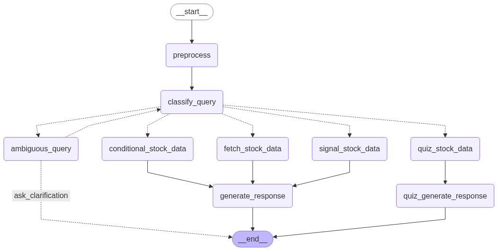
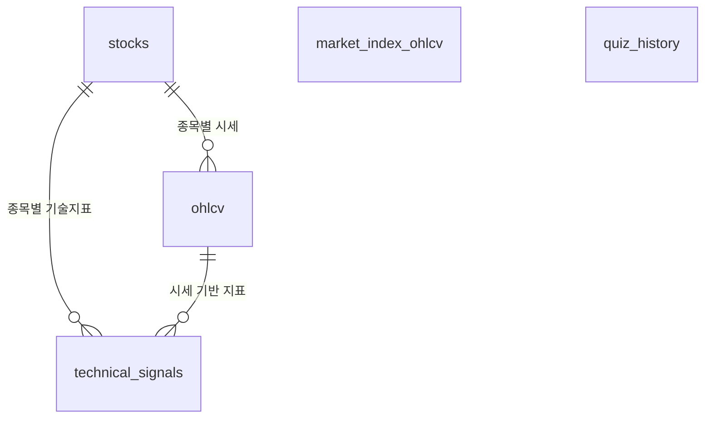

# 금융전문 AI Agent - Allred 팀 설계문서

[Destiny-Stock-URL](http://destiny-stock-bucket.s3-website.kr.object.ncloudstorage.com/)

## 목차

- [API](#api-endpoint)
- [아키텍처](#아키텍처)
  - [LangGraph 워크플로우](#langgraph-워크플로우)
  - [주요 노드 구성](#주요-노드-구성)
- [데이터베이스 구성](#️-데이터베이스-구성)
  - [구조도](#구조도)
  - [데이터 확보 프로세스](#데이터-확보-프로세스)
    - [1단계: 초기 데이터 수집 및 저장](#1단계-초기-데이터-수집-및-저장)
    - [2단계: 기술적 지표 계산 및 저장](#2단계-기술적-지표-계산-및-저장)
- [전처리](#전처리)
- [5가지 핵심 기능](#-5가지-핵심-기능)
  - [Task 1. 간단 주식 조회](#task-1-간단-주식-조회)
  - [Task 2. 조건 검색](#task-2-조건-검색)
  - [Task 3. 시그널 기술지표 기반 조회](#task-3-시그널-기술지표-기반-조회)
  - [Task 4. 애매모호한 표현의 질문 변환 및 재질의](#task-4-애매모호한-표현의-질문-변환-및-재질의)
  - [Task 5. 퀴즈도전! 주식퀴즈 맞추기](#task-5-퀴즈도전-주식퀴즈-맞추기)
- [데이터 소스 및 기술 스택](#데이터-소스-및-기술-스택)

---

## API Endpoint

#### Host/Port: 만료됨.

#### `GET /agent`

- 동시성을 지원하지않습니다. 동시에 1개의 질문만 응답할 수 있습니다.
- HTTPS가 아닌 HTTP로 요청해주시길 바랍니다.
- 배포환경에서 응답시간이 최대 20초까지 발생한 경우를 확인했습니다. Timeout을 여유롭게 설정하고 평가해주시길 요청드립니다.
- Task 1~3 질문으로 분류되고 조회결과가 10건을 초과할경우 최대 10건까지 응답에 포함하여 제공합니다.
- Task 5(주식퀴즈) 요청시 **같은 request_id**로 요청해주셔야 힌트제공, 정/오답처리 맥락 유지가 될 수 있습니다.

```http
GET /agent?question=2024-12-01 삼성전자 종가를 알려줘
Headers: X-NCP-CLOVASTUDIO-REQUEST-ID: {request_id}, Authorization: Bearer <API_KEY>
```

```json
{
  "answer": "삼성전자의 2024-12-01 종가는 75,800원입니다."
}
```

#### `GET /sessions`

```http
GET /sessions
```

```json
{
  "total_sessions": 1,
  "sessions": [
    {
      "session_id": "abcde",
      "quiz_active": true,
      "quiz_phase": "asking",
      "elapsed_minutes": 5.2,
      "last_activity": "2025-07-01T12:30:00"
    }
  ]
}
```

## 아키텍처

### LangGraph 워크플로우



```
사용자 질문 → 전처리 → 질문 분류 → 특화 노드 실행 → 응답 생성
```

### 주요 노드 구성

1. **preprocess**: 기본 정보 추출 (종목명→Ticker, 날짜 검증)
2. **classify_query**: 질문 타입 분류 및 라우팅
3. **fetch_stock_data**: 단순 주식 데이터 조회
4. **conditional_stock_data**: 조건 기반 종목 검색
5. **signal_stock_data**: 기술적 지표 분석
6. **ambiguous_query**: 모호한 질문 구체화
7. **quiz_stock_data**: 주식 퀴즈 시스템
8. **generate_response**: 최종 응답 생성

## 데이터베이스 구성

</details>

### 구조도



<details>
<summary><strong> 데이터베이스 스키마 (클릭하여 펼치기)</strong></summary>

### 주식 기본 정보 (stocks)

```sql
CREATE TABLE stocks
(
    id     INTEGER PRIMARY KEY AUTOINCREMENT,
    ticker VARCHAR UNIQUE INDEX, -- 종목 코드 (예: 005930.KS)
    name   VARCHAR,              -- 종목명
    market VARCHAR               -- 시장 구분 (KOSPI, KOSDAQ)
);
```

### 주식 OHLCV 데이터 (ohlcv)

```sql
CREATE TABLE ohlcv
(
    id          INTEGER PRIMARY KEY AUTOINCREMENT,
    ticker      VARCHAR INDEX, -- 종목 코드
    date        DATE INDEX,    -- 거래일
    open        FLOAT,         -- 시가
    high        FLOAT,         -- 고가
    low         FLOAT,         -- 저가
    close       FLOAT,         -- 종가
    adj_close   FLOAT,         -- 수정종가
    volume      BIGINT,        -- 거래량
    value       BIGINT,        -- 거래대금
    change_rate FLOAT          -- 등락률
);
```

### 시장 지수 데이터 (market_index_ohlcv)

```sql
CREATE TABLE market_index_ohlcv
(
    id     INTEGER PRIMARY KEY AUTOINCREMENT,
    market VARCHAR INDEX, -- 시장 구분
    date   DATE INDEX,    -- 거래일
    open   FLOAT,         -- 시가
    high   FLOAT,         -- 고가
    low    FLOAT,         -- 저가
    close  FLOAT,         -- 종가
    volume BIGINT,        -- 거래량
    value  BIGINT         -- 거래대금
);
```

### 기술적 지표 데이터 (technical_signals)

```sql
CREATE TABLE technical_signals
(
    id        INTEGER PRIMARY KEY AUTOINCREMENT,
    ticker    VARCHAR INDEX, -- 종목 코드
    date      DATE INDEX,    -- 거래일
    indicator VARCHAR,       -- 지표명(CROSS, MA, RSI)
    value     FLOAT          -- 지표값
);
```

### 퀴즈 이력 (quiz_history)

```sql
CREATE TABLE quiz_history
(
    id             INTEGER PRIMARY KEY AUTOINCREMENT,
    request_id     VARCHAR(100), -- 유저구별 ID
    quiz_id        INTEGER,      -- 퀴즈 ID
    quiz_question  TEXT,         -- 퀴즈 문제
    correct_answer VARCHAR(100), -- 정답
    user_answer    VARCHAR(100), -- 사용자 답변
    is_correct     BOOLEAN,      -- 정답 여부
    hint_used      BOOLEAN,      -- 힌트 사용 여부
    reward_stock   VARCHAR(100), -- 보상 종목
    reward_amount  FLOAT,        -- 보상 수량
    completed_at   DATETIME,     -- 완료 시간
    created_at     DATETIME      -- 생성 시간
);
```

</details>

### 데이터 확보 프로세스

AI Agent가 정확한 주식 정보를 제공하기 위해서는 사전에 체계적인 데이터 수집 및 가공 과정이 필요합니다.

Why? 매 질의 마다 yfinance로 요청가능하지만 지연시간과 BB, MA, RSI와 같은 기술지표는 제공되지않기 때문!

### 1단계: 초기 데이터 수집 및 저장

**스크립트**: `db/script/init_and_load.py`

**목적**: 기본 주식 데이터(종목 정보, OHLCV, 시장지수) 수집 및 저장

**수집 데이터**:

- **종목 정보**: KOSPI, KOSDAQ 전체 종목 리스트 (종목명, 티커, 시장구분)
- **OHLCV 데이터**: 개별 종목의 시세 데이터 (시가/고가/저가/종가/거래량/거래대금/등락률)
- **시장지수**: KOSPI(^KS11), KOSDAQ(^KQ11) 지수 데이터

**처리 과정**:

1. pykrx를 통해 영업일 및 종목 리스트 수집
2. yfinance를 통한 종목 시세 데이터 수집
3. 로컬 데이터베이스 저장

### 2단계: 기술적 지표 계산 및 저장

**스크립트**: `db/script/save_technical_signals.py`

**목적**: OHLCV 데이터를 기반으로 기술적 지표 계산 및 저장

**계산 지표**:

- **RSI (상대강도지수)**: 14일 기준 과매수/과매도 신호
- **볼린저밴드**: 20일 이동평균 ± 2표준편차
- **이동평균선**: 5일, 20일, 60일 이동평균
- **거래량 이동평균**: 5일, 20일, 60일 거래량 평균
- **골든크로스/데드크로스**: 5일선과 20일선 교차 신호

**처리 과정**:

1. pandas-ta 라이브러리를 활용한 기술적 지표 계산
2. 일별 종목별 지표값 저장

## 전처리

- **요청일자 추출 및 거래일 검사**: 질문에 포함된 일자를 YYYYMMDD 형식으로 변환하고 해당 일자가 주식거래일인지 검사합니다.
- **주식명 to Ticker**: 질문에 포함된 주식을 Ticker Code로 변환환

```
--최종 background_knowledge: {'check_trading_date': {'query_date': '20241201', 'is_trading_date': False}}--
--주식명 처리: {'stock_list': [{'ticker': '323410.KS', 'name': '카카오뱅크'}, {'ticker': '005380.KS', 'name': '현대차'}], 'count': 2}--

질문: 2024-12-01에 거래량 1000만주 이상인 종목 찾아줘

응답: 죄송합니다. 주어진 날짜인 2024년 12월 1일은 주식 시장이 열리지 않는 날입니다.
따라서, 해당 날짜에는 거래량 조건을 만족하는 어떠한 종목도 찾을 수 없습니다.
다른 날짜나 정보를 제공해 주시면 도움을 드릴 수 있습니다.
```

## 5가지 핵심 기능

### Task 1. 간단 주식 조회

**기능**: 특정 종목, KOSPI, KOSDAQ의 특정 날짜 OHLCV(시가/고가/저가/종가/거래량) 데이터를 조회합니다.

**구현 방식**:

- **노드**: `fetch_stock_data`
- **데이터 소스**: Local DB(ohlcv, market_ohlcv)
- **처리 과정**:
  1. 종목명 → Ticker 변환
  2. 날짜 유효성 검증
  3. yfinance, DB로 데이터 조회

**실행 예시**:

```
질문: "삼성전자 2024-10-04 종가 알려줘"

응답: 삼성전자의 2024-10-04 종가는 60,600원입니다.
```

---

### Task 2. 조건 검색

**기능 설명**: 특정 조건(등락률, 거래량, 종가 등)을 만족하는 종목들을 검색합니다.

**구현 방식**:

- **노드**: `conditional_stock_data`
- **데이터 소스**: Local DB(ohlcv)
- **처리 과정**:
  1. 조건 파싱 (기준값, 비교연산자)
  2. 데이터베이스 쿼리 실행
  3. 최대 10개 결과 정렬 및 필터링
  4. 상세 정보 제공

**실행 예시**:

```
질문: 2024-12-10에 거래량 1000만주 이상인 종목 찾아줘

응답: 2024-12-10에 거래량 1000만 주 이상인 종목은 다음과 같습니다.
1. 폴라리스AI 3,270원 (거래량: 54,416,090주)
2. 써니전자 2,595원 (거래량: 52,104,401주)
3. 일신석재 1,891원 (거래량: 46,389,342주)
4. 삼부토건 1,003원 (거래량: 46,091,660주)
5. 헝셩그룹 318원 (거래량: 31,969,990주)
6. SG 2,990원 (거래량: 25,283,760주)
7. 형지엘리트 2,670원 (거래량: 24,930,897주)
8. 에스와이스틸텍 7,880원 (거래량: 22,768,080주)
9. 삼성전자 54,000원 (거래량: 20,783,970주)
10. iMBC 4,830원 (거래량: 19,711,330주)
```

---

### Task 3. 시그널 기술지표 기반 조회

**기능 설명**: RSI, 볼린저밴드, 이동평균선 등 기술적 지표를 기반으로 매매 신호를 분석합니다.

**구현 방식**:

- **노드**: `signal_stock_data`
- **데이터 소스**: 로컬 SQLite DB (기술적 지표 데이터)
- **지원 지표**:
  - RSI (상대강도지수)
  - 볼린저밴드 (BB)
  - 이동평균선 (MA)
  - 골든크로스/데드크로스
- **처리 과정**:
  1. 기술적 지표 파싱
  2. 조건에 맞는 종목 검색
  3. 신호 강도 분석
  4. 투자 참고 정보 제공

**실행 예시**:

```
질문: 2025-03-10에 RSI 80 이상의 과매수 신호 종목 찾아줘

응답: 2025-03-10에 RSI 80 이상의 과매수 신호 종목은 다음과 같습니다.

1. **알엔투테크놀로지**: 8,410원 (거래량: 154,859주), RSI: 89.86
2. **유안타제17호스팩**: 1,987원 (거래량: 23,973주), RSI: 87.57
3. **이지스레지던스리츠**: 4,150원 (거래량: 37,687주), RSI: 86.57
4. **코스맥스비티아이**: 9,740원 (거래량: 4,322주), RSI: 85.62
5. **빛샘전자**: 4,385원 (거래량: 107,398주), RSI: 85.21
6. **한국항공우주**: 83,800원 (거래량: 3,695,949주), RSI: 84.6
7. **넥스틸**: 16,380원 (거래량: 787,490주), RSI: 84.58
8. **대원산업**: 7,530원 (거래량: 270,316주), RSI: 84.49
9. **프럼파스트**: 5,560원 (거래량: 1,773,978주), RSI: 84.12
10. **이니텍**: 6,040원 (거래량: 578,540주), RSI: 84.12
```

---

### Task 4. 애매모호한 표현의 질문 변환 및 재질의

**기능 설명**: 모호한 질문을 구체화하여 정확한 답변을 제공하기 위한 대화형 질문 변환 시스템입니다.

**구현 방식**:

- **노드**: `ambiguous_query`
- **LLM 모델**: ChatClovaX
- **처리 과정**:
  1. 질문의 정보 완성도 분석  
     1-1. 질문이 '일부' 정보가 부족하다면 부족한 정보를 재질의 요청
     1-2. 질문이 명확한점없이 '애매모호'하다면 자체적으로 질문을 구체화하여 답변변
  2. 부족한 정보 식별
  3. 응답 생성 OR 재질의
  4. 정답시 정답기업의 배경지식을 담은 스낵글을 함께 제공공

**1. 재질의 요청 예시**:

```
정보 완성도: PARTIAL, 부족한 정보: STOCK_NAME

질문: 어제의 종가를 알려줘

응답: 어제의 종가는 알고 싶은 특정 종목이 있으신가요?
```

**2. 자체 구체화 예시(25년 7월 30일에 질의)**

```
정보 완성도: AMBIGUOUS, 부족한 정보: TIME_PERIOD

질문: 요즘 분위기 좋은 종목 있어?

응답: 2025년 7월 23일부터 2025년 7월 29일까지 상승률이 3~7% 사이인 종목들에 대해 조회해봤습니다. 총 292개의 종목이 있으 며 그 중 상위 10개를 소개합니다.

1. **서연이화**: 13,100원 (+6.94%)
2. **잉글우드랩**: 14,060원 (+6.92%)
3. **산일전기**: 99,100원 (+6.9%)
4. **동국생명과학**: 9,660원 (+6.86%)
5. **KBG**: 5,100원 (+6.81%)
6. **타이거일렉**: 16,560원 (+6.7%)
7. **유일에너테크**: 1,960원 (+6.64%)
8. **현대공업**: 6,260원 (+6.64%)
9. **HD현대마린솔루션**: 197,500원 (+6.64%)
10. **DN오토모티브**: 29,000원 (+6.62%)
```

---

### Task 5. 퀴즈도전! 주식퀴즈 맞추기

**기능 설명**: 시가총액 상위 15개 종목을 대상으로 한 주식 퀴즈 시스템으로, 학습과 재미를 동시에 제공합니다.

Agent가 실제 서비스에 제공된다면 24시간마다 퀴즈를 풀어 가장 관심도가 높은 시가총액 상위 15개의 주식을 선물로 제공하여 지속적으로 서비스에 접근할 수 있도록 장치를 마련하는 효과를 기대하고 있습니다.

직전 보상시간 24시간 이후에 추가로 획득가능, 선물받은 주식 조회가능능

**구현 방식**:

- **노드**: `quiz_stock_data`
- **퀴즈 생성**: LLM 기반 동적 생성
- **힌트 시스템**:
  - 기존 힌트: 배경지식 기반
  - 뉴스 기반 힌트: 최신 뉴스 키워드 제공
- **보상 시스템**: 정답 시 해당 종목 100원 상당의 가상 보상
- **세션기반 멀티턴**: 퀴즈 진행 상태 및 시간 관리

**실행 예시**:

```
질문: "퀴즈도전"

응답:
🎯 주식 퀴즈 도전!
문제 #1

Q. 다음 중 한국의 대표적인 반도체 기업은?

① 삼성전자 (005930)
② 현대자동차 (005380)
③ SK하이닉스 (000660)
④ LG전자 (066570)

💡 번호(1,2,3,4), 기업명, 또는 '힌트'를 입력해주세요!

---

사용자: "힌트"

응답:
📰 **최근 뉴스 기반 힌트**

최근 뉴스에서 발견된 관련 키워드:
💡 반도체, 메모리, AI, 자율주행, 전기차

이 키워드들과 관련된 기업을 생각해보세요!

---
퀴즈는 계속 진행 중입니다. 답변을 입력해주세요!

---

사용자: "1"

응답:🎉 정답입니다!

    📚 **기업 정보**

    기아자동차는 자동차 분야의 코스피 최대 시가총액 기업으로, 완성차 제조 및 판매를 통해 수익을 창출합니다. 최근 41일(영업일 기준 약 30거래일) 동안 주가는 5.5% 상승하며 상승 흐름을 이어가고 있습니다. 이는 글로벌 반도체 공급 부족 이슈에도 불구하고 국내와 미국 등 주요 시장에서의 높은 수요에 기인한 것으로 풀이됩니다. 특히 쏘렌토 하이브리드 신차 출시로 인한 매출 증가와 전기차 EV6의 해외 호평이 긍정적인 영향을 미쳤습니다.

    하지만 원자재 가격 상승과 물류비 부담 등의 대외 악재도 존재하므로 지속적인 모니터링이 필요합니다. 또한 미래차 시장 선점을 위한 연구개발 비용 증가와 경쟁 업체들의 추격도 무시할 수 없는 변수입니다. 그럼에도 불구하고 기아차는 안정적인 재무구조와 높은 브랜드 인지도를 바탕으로 성장세를 이어갈 것으로 예상됩니다. 따라서 장기적인 관점에서 투자를 고려해볼 만합니다.

    ⏰ **보상 지급 제한**

    하루에 한 번만 주식 보상을 받을 수 있습니다.
    다음 보상 가능 시간: 2025-07-30 19:32:44

    그래도 퀴즈는 계속 풀 수 있으니 도전해보세요!

    📊 **현재 보유 주식**
    • 현대차: 0.0004587주
    • LG에너지솔루션: 0.0002751주
    • SK하이닉스: 0.0003759주
    총 3회 퀴즈 정답으로 3종목 보유

    🎯 새로운 퀴즈를 원하시면 '주식퀴즈도전'을 입력해주세요!"

```

### 데이터 소스 및 기술 스택

| 데이터 소스                                                                              | 역할              | 설명                                                     | 사용 기술                     |
| ---------------------------------------------------------------------------------------- | ----------------- | -------------------------------------------------------- | ----------------------------- |
| **[pykrx](https://github.com/sharebook-kr/pykrx)**                                       | 종목 정보 수집    | 한국 주식 시장의 종목 리스트, 영업일 정보 제공           | Python 라이브러리             |
| **[yfinance](https://github.com/ranaroussi/yfinance)**                                   | OHLCV 데이터 수집 | 개별 종목의 시세 데이터 (시가, 고가, 저가, 종가, 거래량) | Yahoo Finance API             |
| **[pandas-ta](https://github.com/Data-Analisis/Technical-Analysis-Indicators---Pandas)** | 기술적 지표 계산  | RSI, 볼린저밴드, 이동평균 데드/골든 크로스               | Technical Analysis 라이브러리 |
| **[Naver Search](https://python.langchain.com/docs/integrations/providers/naver/)**      | 실시간 정보 검색  | Langchain 지원 네이버 검색 기능, 퀴즈 힌트용 뉴스 검색   | 네이버 검색 API               |
| **SQLite3**                                                                              | 로컬 데이터 저장  | 주식 데이터, 기술적 지표, 퀴즈 이력 저장                 | 관계형 데이터베이스           |
| **ChatClovaX**                                                                           | LLM               | 질문 분류, 키워드 추출, 퀴즈 생성                        | 네이버 클로바X AI             |
| **LangGraph**                                                                            | 워크플로우 관리   | 노드 간 연결 및 상태 관리                                | 그래프 기반 워크플로우        |
